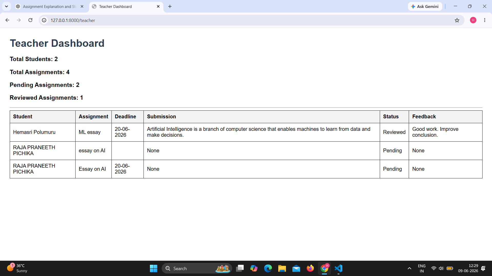
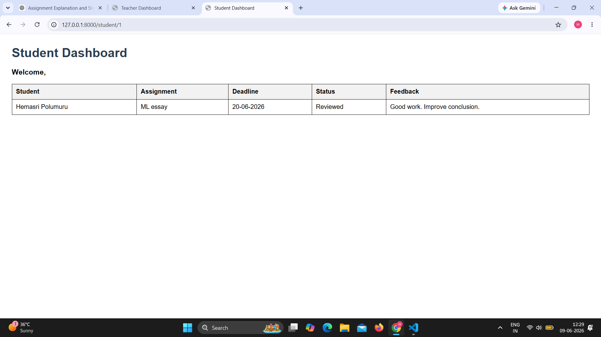

# Classroom Companion

AI-powered classroom management system built using FastAPI, Telegram Bot, SQLite, and Google Gemini AI.

## Overview

Classroom Companion helps teachers and students manage assignments, submissions, feedback, deadlines, and progress updates through a Telegram Bot and Web Dashboard.

The system uses Google Gemini AI to understand natural language instructions and automate classroom workflows.
## Features

### Teacher Features

- Teacher registration through Telegram
- Create assignments
- Assign work to students
- Review submissions
- Provide feedback
- Send reminders
- View student progress through a web dashboard

### Student Features

- Student registration through Telegram
- View assigned work
- Submit assignment content
- Receive feedback
- Track deadlines
- Update assignment progress

#### Assignment Content Submission

Students can submit actual assignment content using:

/submit_content Artificial Intelligence is a branch of computer science...

The submission is stored in the database and can be reviewed by teachers through Telegram and the Teacher Dashboard.

### AI Features

#### Natural Language Assignment Creation

Teachers can create assignments using:

/ai_assign Assign Hemasri a 500-word essay on AI due on 30 June 2026

Gemini AI extracts:
- Student Name
- Assignment Title
- Deadline

and automatically creates the assignment.

#### AI Assignment Review

Teachers can review student submissions using:

/ai_review

Gemini AI analyzes the submission and provides:

- Strengths
- Areas for Improvement
- Suggested Feedback

This helps teachers evaluate assignments more efficiently.

#### Natural Language Progress Updates

Students can provide updates using:

/progress I completed 70% of the AI project today

Gemini AI understands the progress and updates assignment status.

#### AI Question Answering

Students can ask:

/ask Explain Machine Learning

Gemini AI generates responses.
## Technology Stack

### Backend

- Python
- FastAPI
- SQLAlchemy
- SQLite

### AI

- Google Gemini API

### Bot

- Python Telegram Bot

### Frontend

- HTML
- CSS
- Jinja2 Templates

## Project Structure

app/

├── bot/

│   └── telegram_bot.py

│

├── services/

│   └── ai_service.py

│

├── models/

│   ├── student.py

│   ├── teacher.py

│   ├── assignment.py

│   └── assignment_submission.py

│

├── templates/

│   ├── teacher.html

│   └── student.html

│

├── database.py

├── main.py

└── requirements.txt

### Responsibilities

**Telegram Bot Layer**

* Handles teacher and student interactions through Telegram.
* Receives commands and routes requests.

**AI Service Layer**

* Integrates with Google Gemini.
* Handles assignment parsing.
* Processes progress updates.
* Reviews assignment submissions.

**Database Layer**

* Stores teachers, students, assignments, submissions, and feedback.
* Ensures data persists across application restarts.

**Web UI Layer**

* Teacher Dashboard for monitoring students and assignments.
* Student Dashboard for viewing assignments, deadlines, status, and feedback.

## System Architecture

Teacher / Student
        ↓
    Telegram Bot
        ↓
    FastAPI Backend
      ↙      ↘
 Gemini AI   SQLite Database
      ↓         ↓
Teacher Dashboard
Student Dashboard


## Telegram Commands

### Teacher Commands

```text
/teacher
/create_assignment
/assign
/review
/feedback
/remind
/view_students
/view_submissions
```

### Student Commands

```text
/student
/view_assignments
/submit
/submit_content
/view_feedback
```

### AI Commands

```text
/ask
/ai_assign
/progress
/ai_review
```

## Dashboard URLs

### Teacher Dashboard

http://127.0.0.1:8000/teacher

### Student Dashboard

http://127.0.0.1:8000/student/{student_id}

Examples:
http://127.0.0.1:8000/student/1
http://127.0.0.1:8000/student/2

## Dashboard Screenshots

### Teacher Dashboard



### Student Dashboard


## Running the Project

### 1. Create Virtual Environment

```bash
python -m venv venv
```

### 2. Activate Virtual Environment

```bash
venv\Scripts\activate
```

### 3. Install Dependencies

```bash
pip install -r requirements.txt
```

### 4. Configure Environment Variables

Create a `.env` file inside the backend folder and add:

```env
GEMINI_API_KEY=your_api_key_here
BOT_TOKEN=your_telegram_bot_token
```

### 5. Start FastAPI Server

```bash
uvicorn app.main:app --reload
```

### 6. Start Telegram Bot

```bash
python -m app.bot.telegram_bot
```

## Environment Variables

Create a `.env` file using the following template:

```env
GEMINI_API_KEY=your_gemini_api_key
BOT_TOKEN=your_telegram_bot_token
```
An example configuration file (.env.example) is included in the project.

## Database Tables

### Students

- id
- telegram_id
- username
- name

### Teachers

- id
- telegram_id
- username
- name

### Assignments

- id
- title
- description
- deadline
- status

### Assignment Submissions

- id
- student_id
- assignment_id
- submission_text
- status
- feedback

## Project Workflow

Teacher
↓
Creates Assignment
↓
Assigns Assignment to Student
↓
Student Views Assignment
↓
Student Submits Assignment Content
↓
Gemini AI Reviews Submission
↓
Teacher Provides Feedback
↓
Student Receives Feedback
↓
Teacher Monitors Progress Through Dashboard

## AI Prompt Strategy

The project uses Google Gemini AI for natural language understanding and response generation.

### Assignment Parsing

Teachers can create assignments in natural language:

/ai_assign Assign Hemasri a 500-word essay on AI due on 30 June 2026

Gemini extracts:

* Student Name
* Assignment Title
* Deadline

### Progress Interpretation

Students can submit progress updates:

/progress I completed 70% of the AI project today

Gemini interprets:

* Progress Percentage
* Current Status

### Assignment Review

Teachers can request AI-assisted evaluation:

/ai_review

Gemini generates:

* Strengths
* Areas for Improvement
* Suggested Feedback


## Future Improvements

- Attendance Management
- Quiz Management
- File Upload Submissions
- Multi-Teacher Support
- Advanced Analytics Dashboard
- Cloud Deployment
- Automated Deadline-Based Reminders

## Known Limitations

- SQLite used for local development
- Basic authentication system
- Single-machine deployment
- Limited assignment analytics

## AI-Assisted Development

AI tools were used during development for:

- System design and architecture planning
- Prompt engineering
- Code generation assistance
- Debugging support
- Documentation improvements

All generated code was reviewed, tested, and adapted to meet project requirements.

## Author

Hemasri Polumuru

Classroom Companion – AI Powered Classroom Management System